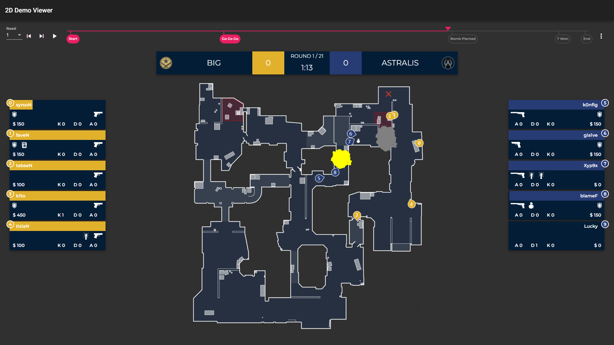

# CsgoDemoViewer2d

Electron Angular Application to view csgo demo file in 2D.
This is my efforts to develop an application to view the pro demo files.
The application is still in development, if you see and issue please raise
a in github.

## Screenshot

# For valid demo to test you can download PRO GOTV demos from HLTV.org
e.g. [Astralis vs BIG IEM Katowice 2022 Play-In](https://www.hltv.org/matches/2354342/astralis-vs-big-iem-katowice-2022-play-in)

Download the GOTV and load into the demo viewer to analyze.

# Supported Maps
Following maps are only supported
- de_ancient
- de_cache
- de_dust2
- de_inferno
- de_mirage
- de_overpass
- de_train

# In Progress Maps
- de_nuke
- de_vertigo

## Useful Links
- [CS:GO Demo Parser: saul/demofile](https://github.com/saul/demofile)
- [CS:GO lexogrine/hud-viewer](https://github.com/lexogrine/hud-viewer)
